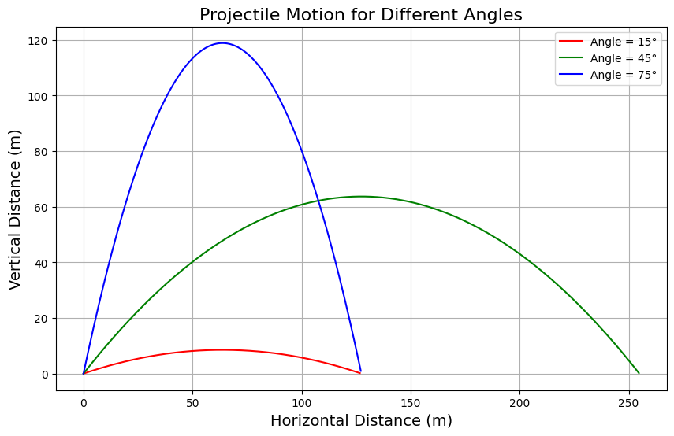

# 🛰️ Problem 1 – Investigating the Range as a Function of the Angle of Projection
**Physics** | **Mechanics** | **KW1 Assignment**  
**Author:** Bartu867  
**Date:** March 29, 2025  
---
# Mechanics Project
# 📚 Problem 1: Investigating the Range as a Function of the Angle of Projection

## 1. Theoretical Foundation

### • Derivation of Equations of Motion

Starting from Newton’s Second Law:

$$\vec{F}=m\vec{a}$$

In the absence of air resistance, the only force acting on the projectile (after launch) is gravity:

$$\vec{a}=(0,-g)$$

where $g$ is the gravitational acceleration.

Thus, the equations of motion are:

- In horizontal ($x$) direction:

$$\frac{d^2x}{dt^2}=0\quad\Rightarrow\quad\frac{dx}{dt}=v_{0x}=v_0\cos(\theta)$$

- In vertical ($y$) direction:

$$\frac{d^2y}{dt^2}=-g\quad\Rightarrow\quad\frac{dy}{dt}=v_{0y}-gt=v_0\sin(\theta)-gt$$

Integrating once more:

- Horizontal position:

$$x(t)=v_0\cos(\theta)t$$

- Vertical position:

$$y(t)=v_0\sin(\theta)t-\frac{1}{2}gt^2$$

---

### • Varying Initial Conditions

- **Initial velocity $v_0$**: Higher $v_0$ increases both maximum height and range.
- **Gravitational acceleration $g$**: Higher $g$ reduces flight time and range.
- **Launch height**: Here assumed zero; can be generalized for non-zero launch heights.

---

## 2. Analysis of the Range

### • Derivation of Range Formula

The projectile hits the ground again when $y(T)=0$. Solving:

$$0=v_0\sin(\theta)T-\frac{1}{2}gT^2$$

which gives:

$$T=\frac{2v_0\sin(\theta)}{g}$$

**Range** $R$ is the horizontal distance traveled during flight:

$$R=x(T)=v_0\cos(\theta)T$$

Substituting for $T$:

$$R=\frac{v_0^2\sin(2\theta)}{g}$$

---

### • Parameter Dependence

- **$v_0$**: Range is proportional to $v_0^2$.
- **$g$**: Range is inversely proportional to $g$.
- **$\theta$**: Range depends on $\sin(2\theta)$, maximized at $45^\circ$.

---

## 3. Practical Applications

- **Uneven Terrain**: Modify landing conditions for non-zero final height.
- **Air Resistance**: Add drag force proportional to velocity.
- **Different Planetary Gravities**: Adjust $g$ to simulate other environments (e.g., Moon, Mars).

---

## 4. Implementation in Python



```python

import numpy as np
import matplotlib.pyplot as plt

```

# Parameters
v0 = 50  # Initial velocity (m/s)
g = 9.81  # Gravitational acceleration (m/s^2)
angles = [15, 45, 75]  # Launch angles in degrees
colors = ['r', 'g', 'b']  # Colors for different angles

```

# Time of flight for each angle (when y = 0)
def time_of_flight(v0, angle, g):
    angle_rad = np.radians(angle)
    return (2 * v0 * np.sin(angle_rad)) / g

# Function to compute x and y positions at time t
def projectile_motion(v0, angle, g, t):
    angle_rad = np.radians(angle)
    x = v0 * np.cos(angle_rad) * t
    y = v0 * np.sin(angle_rad) * t - 0.5 * g * t**2
    return x, y

```

# Time points for the plot (up to time of flight)
time_max = max(time_of_flight(v0, angle, g) for angle in angles)
t_values = np.linspace(0, time_max, num=500)

# Plot projectile motion for each angle
plt.figure(figsize=(10, 6))

for angle, color in zip(angles, colors):
    x_values = []
    y_values = []
    
    for t in t_values:
        x, y = projectile_motion(v0, angle, g, t)
        if y < 0:  # Stop the simulation when projectile hits the ground
            break
        x_values.append(x)
        y_values.append(y)
    
    plt.plot(x_values, y_values, label=f'Angle = {angle}°', color=color)

# Labels and title
plt.title('Projectile Motion for Different Angles', fontsize=16)
plt.xlabel('Horizontal Distance (m)', fontsize=14)
plt.ylabel('Vertical Distance (m)', fontsize=14)
plt.legend()
plt.grid(True)
plt.show()


```