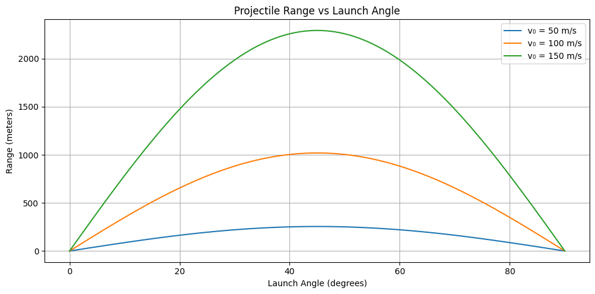

# Problem 2 – Investigating the Dynamics of a Forced Damped Pendulum

**Physics** | **Mechanics** | **KW1 Assignment**  
**Author:** Bartu867  
**Date:** March 27, 2025

---

## 🎯 Goal

Analyze the motion of a forced damped pendulum and observe how different parameters influence its behavior — including regular, resonant, and chaotic motion.

---

## 📘 Theoretical Background

The motion of a forced damped pendulum is governed by the second-order nonlinear differential equation:

\[
\frac{d^2\theta}{dt^2} + b\frac{d\theta}{dt} + \omega_0^2 \sin(\theta) = A \cos(\omega t)
\]

Where:  
- \( \theta \): angular displacement  
- \( b \): damping coefficient  
- \( \omega_0 \): natural frequency  
- \( A \): amplitude of external force  
- \( \omega \): driving frequency  

---

## 💻 Python Simulation

Below is a Python simulation of the pendulum using the Runge-Kutta 4th order method.
---

![alt text][def]
```python
import numpy as np
import matplotlib.pyplot as plt

# Parameters
b = 0.5              # damping
w0 = 1.5             # natural frequency
A = 1.2              # driving force amplitude
w = 0.666            # driving frequency
dt = 0.04            # time step
T = 100              # total time

# Time array
t = np.arange(0, T, dt)

# Arrays for theta and omega
theta = np.zeros_like(t)
omega = np.zeros_like(t)

# Initial conditions
theta[0] = 0.2
omega[0] = 0.0

# Runge-Kutta 4th order method
for i in range(1, len(t)):
    k1_theta = dt * omega[i - 1]
    k1_omega = dt * (-b * omega[i - 1] - w0**2 * np.sin(theta[i - 1]) + A * np.cos(w * t[i - 1]))

    k2_theta = dt * (omega[i - 1] + 0.5 * k1_omega)
    k2_omega = dt * (-b * (omega[i - 1] + 0.5 * k1_omega) - w0**2 * np.sin(theta[i - 1] + 0.5 * k1_theta) + A * np.cos(w * (t[i - 1] + 0.5 * dt)))

    k3_theta = dt * (omega[i - 1] + 0.5 * k2_omega)
    k3_omega = dt * (-b * (omega[i - 1] + 0.5 * k2_omega) - w0**2 * np.sin(theta[i - 1] + 0.5 * k2_theta) + A * np.cos(w * (t[i - 1] + 0.5 * dt)))

    k4_theta = dt * (omega[i - 1] + k3_omega)
    k4_omega = dt * (-b * (omega[i - 1] + k3_omega) - w0**2 * np.sin(theta[i - 1] + k3_theta) + A * np.cos(w * (t[i - 1] + dt)))

    theta[i] = theta[i - 1] + (k1_theta + 2 * k2_theta + 2 * k3_theta + k4_theta) / 6
    omega[i] = omega[i - 1] + (k1_omega + 2 * k2_omega + 2 * k3_omega + k4_omega) / 6

# Plotting
plt.figure(figsize=(10, 5))
plt.plot(t, theta)
plt.title("Forced Damped Pendulum – Angular Displacement Over Time")
plt.xlabel("Time (s)")
plt.ylabel("Angle (rad)")
plt.grid(True)
plt.show()


[def]: image-3.png