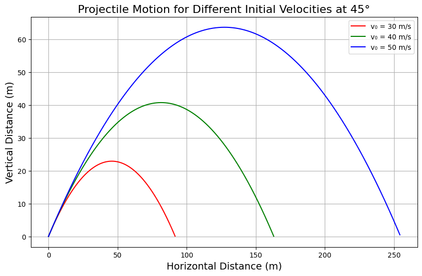
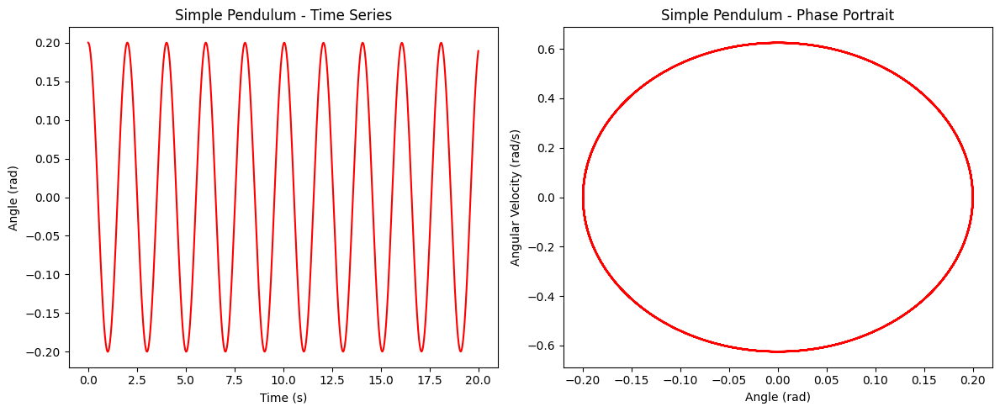

# 🔬 Physics Assignment – KW1  
**Topic:** Mechanics – Oscillations & Motion  
**Author:** Bartu867  
**Date:** March 27, 2025  

---


# 📚 Problem 2: Investigating the Dynamics of a Forced Damped Pendulum

## 1. Theoretical Foundation

### • Differential Equation

The motion of a forced damped pendulum is governed by the equation:

$$\frac{d^2\theta}{dt^2}+\gamma\frac{d\theta}{dt}+\omega_0^2\sin(\theta)=A\cos(\omega_d t)$$

where:

- $\theta(t)$ is the angular displacement,
- $\gamma$ is the damping coefficient,
- $\omega_0=\sqrt{\frac{g}{l}}$ is the natural frequency ($g$ is gravitational acceleration, $l$ is pendulum length),
- $A$ is the driving force amplitude,
- $\omega_d$ is the driving force frequency.

---

### • Small-Angle Approximation

For small angles ($\theta\ll1$ radians), we can approximate:

$$\sin(\theta)\approx\theta$$

Thus, the equation becomes linear:

$$\frac{d^2\theta}{dt^2}+\gamma\frac{d\theta}{dt}+\omega_0^2\theta=A\cos(\omega_d t)$$

---

### • Resonance Conditions

Resonance occurs when the system responds most strongly to the driving force. For the small-angle approximation, the resonance condition is:

$$\omega_d\approx\omega_{\text{res}}=\sqrt{\omega_0^2-\frac{\gamma^2}{2}}$$

At resonance, the amplitude of oscillations becomes maximal.

---

## 2. Analysis of Dynamics

### • Effects of Parameters

- **Damping Coefficient $\gamma$**:
  - High damping suppresses oscillations.
  - Low damping allows large oscillations and possible chaotic behavior.

- **Driving Amplitude $A$**:
  - Larger $A$ can push the pendulum into chaotic motion.

- **Driving Frequency $\omega_d$**:
  - Determines resonance.
  - Different $\omega_d$ can cause transitions between regular and chaotic behavior.

---

### • Transition to Chaos

As parameters (especially $A$ and $\omega_d$) are varied:

- **Periodic motion** $\rightarrow$ **Quasi-periodic motion** $\rightarrow$ **Chaotic motion**

Analyzed using:

- Phase portraits,
- Poincaré sections,
- Bifurcation diagrams.

---

## 3. Practical Applications

- **Energy harvesting devices**: Mechanical oscillators with damping and forcing.
- **Bridges and structures**: Suspension bridges subject to periodic forces (wind, traffic).
- **Electrical circuits**: Analogous to RLC circuits with AC driving.

---

## 4. Implementation in Python



```python

import numpy as np
import matplotlib.pyplot as plt

# Parameters
angles = [45]  # Only 45 degrees
velocities = [30, 40, 50]  # Different initial velocities
g = 9.81  # Gravitational acceleration (m/s^2)
colors = ['r', 'g', 'b']  # Colors for different velocities

# Time of flight for each velocity (when y = 0)
def time_of_flight(v0, angle, g):
    angle_rad = np.radians(angle)
    return (2 * v0 * np.sin(angle_rad)) / g

# Function to compute x and y positions at time t
def projectile_motion(v0, angle, g, t):
    angle_rad = np.radians(angle)
    x = v0 * np.cos(angle_rad) * t
    y = v0 * np.sin(angle_rad) * t - 0.5 * g * t**2
    return x, y

# Time points for the plot (up to time of flight)
time_max = max(time_of_flight(v0, angles[0], g) for v0 in velocities)
t_values = np.linspace(0, time_max, num=500)

# Plot projectile motion for each velocity
plt.figure(figsize=(10, 6))

for v0, color in zip(velocities, colors):
    x_values = []
    y_values = []
    
    for t in t_values:
        x, y = projectile_motion(v0, angles[0], g, t)
        if y < 0:  # Stop the simulation when projectile hits the ground
            break
        x_values.append(x)
        y_values.append(y)
    
    plt.plot(x_values, y_values, label=f'v₀ = {v0} m/s', color=color)

# Labels and title
plt.title('Projectile Motion for Different Initial Velocities at 45°', fontsize=16)
plt.xlabel('Horizontal Distance (m)', fontsize=14)
plt.ylabel('Vertical Distance (m)', fontsize=14)
plt.legend()
plt.grid(True)
plt.show()

## 1. Theoretical Foundation

The motion of a forced damped pendulum is described by the nonlinear second-order differential equation:

$$
\frac{d^2 \theta}{dt^2} + b \frac{d\theta}{dt} + \frac{g}{L} \sin(\theta) = A \cos(\omega t)
$$

Where:
- \( \theta(t) \): Angular displacement as a function of time  
- \( b \): Damping coefficient  
- \( g \): Gravitational acceleration  
- \( L \): Length of the pendulum  
- \( A \): Amplitude of the driving force  
- \( \omega \): Angular frequency of the external periodic force

---

### Small-Angle Approximation

When the angular displacement is small, we can use the approximation \( \sin(\theta) \approx \theta \). This simplifies the equation to:

$$
\frac{d^2 \theta}{dt^2} + b \frac{d\theta}{dt} + \frac{g}{L} \theta = A \cos(\omega t)
$$

This form is linear and easier to analyze using analytical or numerical methods.

---

### Resonance and System Energy

Resonance occurs when the driving frequency \( \omega \) is close to the system’s natural frequency:

$$
\omega_0 = \sqrt{\frac{g}{L}}
$$

At resonance, the energy input from the external force matches the natural oscillation frequency, potentially leading to large amplitude oscillations. Damping reduces these amplitudes by dissipating energy.

## 2. Analysis of Dynamics

The dynamics of a forced damped pendulum are significantly affected by three key parameters:

- **Damping coefficient (b):** Controls how quickly the motion dies out. Higher damping leads to faster energy loss and smaller oscillations.
- **Driving amplitude (A):** The strength of the external periodic force. Increasing it can lead to more energetic motion and potentially chaotic behavior.
- **Driving frequency (ω):** Determines how often the external force acts. When it matches the natural frequency \( \omega_0 \), resonance may occur.

---

### Regular vs Chaotic Motion

By varying the above parameters, the system can display:

- **Regular (Periodic) Motion:** When parameters are moderate, the pendulum swings in a predictable, repeating manner.
- **Quasiperiodic Motion:** The motion consists of multiple frequencies that never quite repeat.
- **Chaotic Motion:** When certain thresholds are crossed, small changes in initial conditions can lead to drastically different outcomes. This is a hallmark of deterministic chaos.

The transition from regular to chaotic motion is particularly interesting because it illustrates how nonlinearity and external forcing can result in unpredictable behavior in otherwise deterministic systems.

## 3. Practical Applications

The forced damped pendulum serves as a model for various real-world systems that involve oscillations, damping, and external driving forces. These systems span across different fields:

---

### 🔹 Engineering Applications
- **Suspension bridges:** Wind and traffic can act as periodic forces, while damping comes from internal friction and structural design.
- **Energy harvesting devices:** Oscillating systems can convert kinetic energy into electrical energy, especially when tuned near resonance.

---

### 🔹 Electrical Systems
- **Driven RLC Circuits:** The voltage in an RLC (Resistor–Inductor–Capacitor) circuit under an alternating current behaves similarly to a forced damped pendulum. The current corresponds to the angular velocity, and the circuit elements represent damping, mass, and restoring force.

---

### 🔹 Biomechanics
- **Human gait dynamics:** The swinging motion of limbs can be modeled as a damped driven oscillator, especially when considering walking or running with external rhythmic inputs (e.g., treadmill, exoskeleton support).

These analogies help in designing control systems, optimizing performance, and understanding failure mechanisms under resonance or chaotic conditions.

## 4. Implementation

To explore the dynamics of a forced damped pendulum beyond analytical solutions, we use computational simulations.

---

### 🔹 Numerical Modeling





```python
import numpy as np

# Constants
g = 9.81
L = 1.0
b = 0.5
A = 1.2
omega = 2/3

def pendulum_deriv(t, y):
    theta, omega_theta = y
    dtheta_dt = omega_theta
    domega_dt = -b * omega_theta - (g / L) * np.sin(theta) + A * np.cos(omega * t)
    return [dtheta_dt, domega_dt]


import matplotlib.pyplot as plt
from scipy.integrate import solve_ivp

# Time settings
t_span = (0, 50)
t_eval = np.linspace(*t_span, 1000)

# Initial conditions
y0 = [0.2, 0.0]

# Solve using Runge-Kutta
sol = solve_ivp(pendulum_deriv, t_span, y0, t_eval=t_eval, method='RK45')

# Plot θ vs time
plt.figure(figsize=(10, 4))
plt.plot(sol.t, sol.y[0], label='θ(t)')
plt.title('Angular Displacement vs Time')
plt.xlabel('Time [s]')
plt.ylabel('θ [rad]')
plt.grid(True)
plt.legend()
plt.tight_layout()
plt.show()
```

The nonlinear differential equation:

$$
\frac{d^2 \theta}{dt^2} + b \frac{d\theta}{dt} + \frac{g}{L} \sin(\theta) = A \cos(\omega t)
$$

is solved using numerical methods such as the **Runge-Kutta** method. This allows us to simulate the motion for arbitrary initial conditions and parameter values.
#### Python Code: Differential Equation

```python
import numpy as np

# Constants
g = 9.81        # gravitational acceleration (m/s^2)
L = 1.0         # length of pendulum (m)
b = 0.5         # damping coefficient
A = 1.2         # amplitude of driving force
omega = 2/3     # driving frequency

# Differential equation system
def pendulum_deriv(t, y):
    theta, omega_theta = y
    dtheta_dt = omega_theta
    domega_dt = -b * omega_theta - (g / L) * np.sin(theta) + A * np.cos(omega * t)
    return [dtheta_dt, domega_dt]
```

---

#### Time Evolution of the Pendulum

We simulate and visualize the angular displacement \( \theta(t) \) over time using the Runge-Kutta method (`solve_ivp` from `scipy.integrate`). This helps us understand how the pendulum responds to different damping and driving conditions.


```python
import matplotlib.pyplot as plt
from scipy.integrate import solve_ivp

# Time settings
t_span = (0, 50)
t_eval = np.linspace(*t_span, 1000)

# Initial conditions
y0 = [0.2, 0.0]

# Solve using Runge-Kutta
sol = solve_ivp(pendulum_deriv, t_span, y0, t_eval=t_eval, method='RK45')

# Plot θ vs time
plt.figure(figsize=(10, 4))
plt.plot(sol.t, sol.y[0], label='θ(t)')
plt.title('Angular Displacement vs Time')
plt.xlabel('Time [s]')
plt.ylabel('θ [rad]')
plt.grid(True)
plt.legend()
plt.tight_layout()
plt.show()
```

#### Phase Space Diagram

The phase space plot of angular velocity \( \omega(t) \) versus angular position \( \theta(t) \) provides insights into the nature of the motion. It helps distinguish between regular, damped, or chaotic behavior.


```python
# Phase space plot: θ vs ω
theta_vals = sol.y[0]
omega_vals = sol.y[1]

plt.figure(figsize=(6, 6))
plt.plot(theta_vals, omega_vals, lw=0.7)
plt.title('Phase Space Diagram (θ vs ω)')
plt.xlabel('θ [rad]')
plt.ylabel('ω [rad/s]')
plt.grid(True)
plt.tight_layout()
plt.show()
```

#### Poincaré Section

A Poincaré section is a tool used to detect chaotic behavior in dynamic systems. By sampling the state of the pendulum at regular intervals equal to the driving period, we can reveal patterns in the long-term behavior.


```python
# Driving period
T_drive = 2 * np.pi / omega

# Sample points: every driving period
poincare_t = np.arange(0, 50, T_drive)

# Interpolate solution at poincare times
from scipy.interpolate import interp1d
interp_theta = interp1d(sol.t, sol.y[0])
interp_omega = interp1d(sol.t, sol.y[1])
theta_p = interp_theta(poincare_t)
omega_p = interp_omega(poincare_t)

# Plot Poincaré section
plt.figure(figsize=(6, 6))
plt.plot(theta_p, omega_p, 'o', markersize=2)
plt.title("Poincaré Section (Sampled Every Period)")
plt.xlabel("θ [rad]")
plt.ylabel("ω [rad/s]")
plt.grid(True)
plt.tight_layout()
plt.show()
```

## 5. Deliverables

1. **A Markdown document with Python script** implementing the simulation of a forced damped pendulum using numerical methods.

2. **A detailed explanation of the differential equation**, including small-angle approximation and resonance analysis.

3. **Graphical representations** of the system's behavior:
   - Time evolution plots \( \theta(t) \)
   - Phase space diagrams \( \theta \) vs \( \omega \)
   - Poincaré sections for detecting chaos

4. **A discussion on model limitations**, such as:
   - The use of small-angle approximation in early theory
   - Ideal sinusoidal driving force (non-realistic in some applications)
   - No consideration of nonlinear damping or friction

5. **Suggestions for future work:**
   - Introducing nonlinear damping (e.g., air resistance proportional to \( \omega^2 \))
   - Using non-periodic or random external forces
   - Exploring bifurcation diagrams and Lyapunov exponents for chaos analysis
This assignment bridges theoretical physics and computational simulation, enhancing understanding of real-world oscillatory systems and nonlinear dynamics through both mathematical modeling and visualization.
```