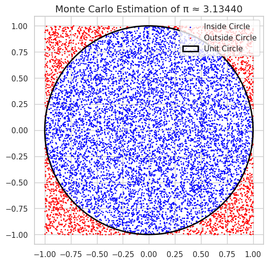
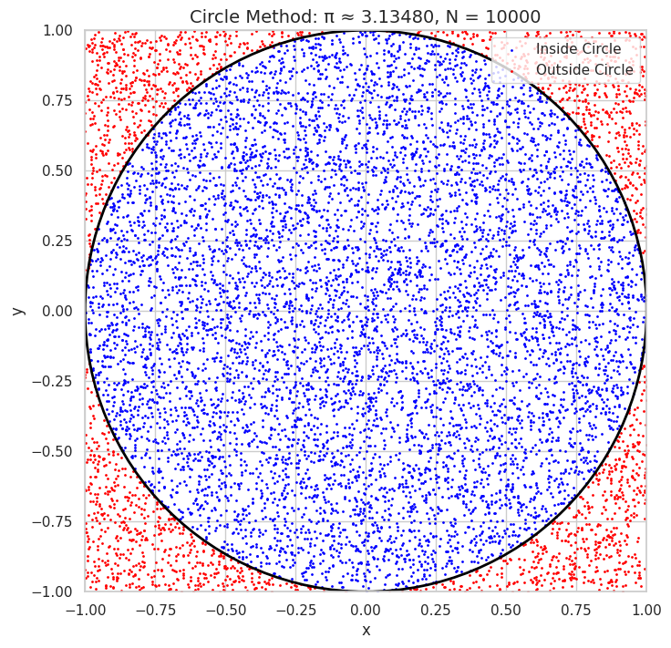
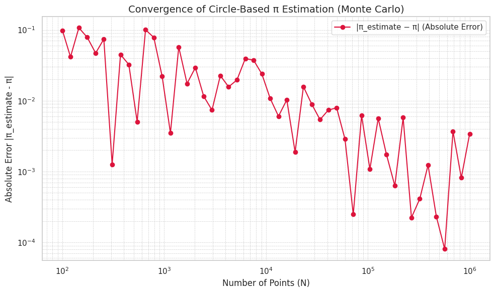
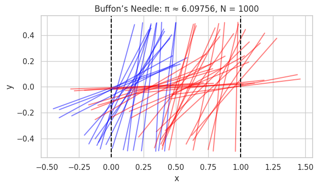
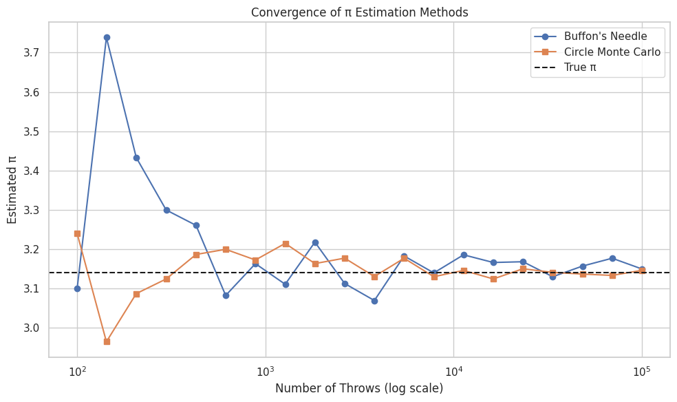

# Problem 2
# 📘 Part 1: Estimating π Using a Circle

## 1. Theoretical Foundation

### 🧠 Conceptual Overview

Monte Carlo methods use randomness to solve problems that might be deterministic in principle. For estimating π, we use the geometric relationship between a circle and its bounding square:

- Consider a **unit circle** (radius = 1) centered at the origin (0,0).
- The circle is inscribed inside a **square** with side length 2, spanning coordinates from (-1, -1) to (1, 1).
- The **area** of the unit circle is:

  $$
  A_{circle}=\pi r^2=\pi\cdot1^2=\pi
  $$

- The **area** of the square is:

  $$
  A_{square}=(2r)^2=(2\cdot1)^2=4
  $$

- The ratio of the areas is:

  $$
  \frac{A_{circle}}{A_{square}}=\frac{\pi}{4}
  $$

Thus, if we randomly generate points uniformly in the square, the **probability** that a point falls inside the circle is:

  $$
  P(\text{point in circle})=\frac{\pi}{4}
  $$

### 🔢 Monte Carlo Estimation of π

To estimate π using this geometric probability:

1. **Generate** a large number of random points $(x, y)$ in the square $[-1, 1] \times [-1, 1]$.
2. **Check** whether each point lies inside the unit circle using:

   $$
   x^2 + y^2 \leq 1
   $$

3. **Count** the number of points that fall inside the circle: $N_{circle}$
4. **Total** number of generated points: $N_{total}$
5. Estimate π using:

   $$
   \hat{\pi}=4\cdot\frac{N_{circle}}{N_{total}}
   $$

### ✅ Summary

- Monte Carlo estimation of π relies on simulating randomness and measuring proportions.
- The larger the number of points $N_{total}$, the more accurate the estimation.
- This method visually and intuitively links **geometry, probability, and numerical approximation**.



```python

# ✅ Required libraries
import numpy as np
import matplotlib.pyplot as plt

# ✅ Total number of random points
N = 10_000

# ✅ Generate random (x, y) points in the square [-1, 1] × [-1, 1]
x = np.random.uniform(-1, 1, N)
y = np.random.uniform(-1, 1, N)

# ✅ Calculate squared distance from origin
distance_squared = x**2 + y**2

# ✅ Determine which points fall inside the unit circle
inside_circle = distance_squared <= 1

# ✅ Estimate π using the Monte Carlo method
pi_estimate = 4 * np.sum(inside_circle) / N
print(f"Estimated π ≈ {pi_estimate:.5f}")

# ✅ Visualization
plt.figure(figsize=(6, 6))

# Plot points inside and outside the circle
plt.scatter(x[inside_circle], y[inside_circle], color='blue', s=1, label='Inside Circle')
plt.scatter(x[~inside_circle], y[~inside_circle], color='red', s=1, label='Outside Circle')

# Draw the unit circle boundary
circle = plt.Circle((0, 0), 1, color='black', fill=False, linewidth=2, label='Unit Circle')
plt.gca().add_artist(circle)

# Formatting the plot
plt.axis('equal')  # Ensure aspect ratio is 1:1
plt.title(f'Monte Carlo Estimation of π ≈ {pi_estimate:.5f}', fontsize=14)
plt.legend(loc='upper right')
plt.grid(True)
plt.show()


```
---

### 🖥 2. Simulation

In this section, we implement a Monte Carlo simulation to estimate the value of π by randomly generating points in a square and analyzing how many fall within an inscribed circle.

### 🧪 Simulation Steps

- We consider a **unit circle** of radius 1 centered at the origin $(0,0)$.
- This circle is inscribed in a **square** with side length 2, which spans coordinates:

  $$
  [-1,1] \times [-1,1]
  $$

- The idea is to generate $N$ random points $(x, y)$ uniformly within this square and count how many fall inside the circle.

### ➕ Inside Circle Criterion

- A point $(x, y)$ lies **inside the unit circle** if:

  $$
  x^2 + y^2 \leq 1
  $$

- Let $N_{\text{circle}}$ be the number of points that satisfy this condition.
- Let $N_{\text{total}}$ be the total number of points generated.

### 🔢 Monte Carlo Estimation Formula

- The probability of a point falling inside the circle is approximately:

  $$
  P = \frac{\pi}{4}
  $$

- Therefore, we estimate π using:

  $$
  \hat{\pi} = 4 \cdot \frac{N_{\text{circle}}}{N_{\text{total}}}
  $$

### 📝 Notes

- The accuracy of the estimate improves as $N_{\text{total}}$ increases.
- Randomness introduces variance; repeated runs may yield slightly different values.
- This approach is simple but powerful and visually intuitive.

> ✅ This method demonstrates how probabilistic simulations can approximate deterministic mathematical constants using geometry.
---


### 3 Visualization

The following Python code generates a scatter plot distinguishing points inside and outside the unit circle.




```python
# ✅ Import libraries
import numpy as np
import matplotlib.pyplot as plt

# ✅ Set seed for reproducibility
np.random.seed(42)

# ✅ Define estimation function
def estimate_pi_circle(N):
    # Generate N random points in square [-1, 1] × [-1, 1]
    x = np.random.uniform(-1, 1, N)
    y = np.random.uniform(-1, 1, N)
    
    # Check if points are inside unit circle
    inside_circle = x**2 + y**2 <= 1
    M = np.sum(inside_circle)  # Count inside-circle points
    
    # Estimate π
    pi_estimate = 4 * M / N
    
    return x, y, inside_circle, pi_estimate

# ✅ Run simulation
N = 10_000
x, y, inside_circle, pi_estimate = estimate_pi_circle(N)

# ✅ Visualization
plt.figure(figsize=(8, 8))
plt.scatter(x[inside_circle], y[inside_circle], c='blue', s=1, label='Inside Circle')
plt.scatter(x[~inside_circle], y[~inside_circle], c='red', s=1, label='Outside Circle')

# Draw unit circle boundary
circle = plt.Circle((0, 0), 1, edgecolor='black', facecolor='none', linewidth=2)
plt.gca().add_patch(circle)

# Plot settings
plt.gca().set_aspect('equal')
plt.xlim(-1, 1)
plt.ylim(-1, 1)
plt.title(f'Circle Method: π ≈ {pi_estimate:.5f}, N = {N}', fontsize=14)
plt.xlabel('x')
plt.ylabel('y')
plt.legend()
plt.grid(True)
plt.show()

# ✅ Final print
print(f"Estimated π: {pi_estimate}")


```
 ---

### 4 Analysis

To study convergence, we compute the absolute error \( |\pi_{\text{estimate}} - \pi| \) for increasing \( N \).



```python
# ✅ Gerekli kütüphaneler
import numpy as np
import matplotlib.pyplot as plt

# ✅ Monte Carlo yöntemi ile π tahmini yapan fonksiyon
def estimate_pi_circle(N):
    np.random.seed(0)  # Sabit tohum (seed) -> tekrarlanabilir sonuç
    x = np.random.rand(N)
    y = np.random.rand(N)
    inside_circle = (x**2 + y**2) <= 1
    count_inside = np.sum(inside_circle)
    pi_estimate = 4 * count_inside / N
    return x, y, inside_circle, pi_estimate

# ✅ Farklı örneklem büyüklükleri için hata analizi
Ns = np.logspace(2, 6, num=50, dtype=int)  # 100 ile 1.000.000 arası log ölçekli N değerleri
errors = []
pi_true = np.pi  # Gerçek π değeri

# ✅ Her N için π tahmini ve hata hesabı
for N in Ns:
    _, _, _, pi_estimate = estimate_pi_circle(N)
    errors.append(abs(pi_estimate - pi_true))

# ✅ Hata grafiği (log-log eksenler)
plt.figure(figsize=(10, 6))
plt.loglog(Ns, errors, 'o-', color='crimson', label='|π_estimate − π| (Absolute Error)')
plt.axhline(0, color='gray', linestyle='--', linewidth=1)
plt.title('Convergence of Circle-Based π Estimation (Monte Carlo)', fontsize=14)
plt.xlabel('Number of Points (N)', fontsize=12)
plt.ylabel('Absolute Error |π_estimate - π|', fontsize=12)
plt.grid(True, which='both', linestyle='--', linewidth=0.5)
plt.legend()
plt.tight_layout()
plt.show()

```
---


# ✅ PART 2: Estimating π Using Buffon’s Needle

## 📘 1. Theoretical Foundation

### 🧠 Introduction to Buffon’s Needle Problem

Buffon’s Needle is a classic probability problem that provides a method to estimate π using random trials involving dropping a needle on a plane ruled with parallel lines. The problem explores the probability that a needle of length $L$ dropped randomly onto a floor marked with parallel lines spaced $d$ units apart will cross one of these lines.

---

### 🔍 Problem Setup and Assumptions

- The plane has **parallel lines** spaced at distance $d$ apart.
- A needle of length $L$ is randomly thrown onto the plane.
- The needle’s position is characterized by:
  - The distance $x$ from the needle’s center to the nearest line (with $0 \leq x \leq \frac{d}{2}$).
  - The angle $\theta$ between the needle and the parallel lines, where $\theta$ is uniformly distributed in $[0, \frac{\pi}{2}]$ due to symmetry.

---

### 📐 Condition for Needle Crossing a Line

The needle crosses a line if the distance from the center to the closest line is less than or equal to half the projected length of the needle on the axis perpendicular to the lines:

$$
x \leq \frac{L}{2} \sin \theta
$$

---

### 📊 Probability of Crossing

The probability $P$ that a needle crosses a line is derived by integrating over all possible positions and orientations, yielding:

$$
P = \frac{2L}{\pi d}
$$

*This formula assumes $L \leq d$.*

---

### 🔢 Derivation of the π Estimation Formula

Let:

- $L$ = length of the needle  
- $d$ = distance between the parallel lines  
- $N$ = total number of needle throws  
- $C$ = number of times the needle crosses a line  

From the observed experimental probability,

$$
P \approx \frac{C}{N}
$$

and equating to the theoretical probability,

$$
\frac{C}{N} \approx \frac{2L}{\pi d}
$$

Solving for π, we get the estimate:

$$
\boxed{
\pi \approx \frac{2 L N}{d C}
}
$$

---

### ✅ Summary

- Buffon’s Needle problem connects geometry and probability to estimate π.
- It provides an elegant, physical experiment-based approach to numerical estimation.
- Accuracy improves as $N$ (number of needle throws) increases.
- The problem is a foundational example in geometric probability and Monte Carlo methods.

## 2. Simulation

We now implement the simulation of Buffon’s Needle experiment to estimate π.

### Simulation Procedure

- **Step 1:** Simulate $N$ random needle drops on a plane with parallel lines spaced by distance $d$.
- **Step 2:** For each needle drop:
  - Sample the needle's center position $x$ uniformly from $[0, d/2]$.
  - Sample the needle's orientation angle $\theta$ uniformly from $[0, \pi/2]$.
- **Step 3:** Determine whether the needle crosses a line by checking the condition:

$$
x \leq \frac{L}{2} \sin \theta
$$

- **Step 4:** Count the number of crossings $C$.
- **Step 5:** Estimate π using the formula:

$$
\hat{\pi} = \frac{2 L N}{d C}
$$


### 3 Visualization



```python

# ✅ Gerekli kütüphaneler
# 🧠 π Tahmini: Buffon's Needle vs Circle Monte Carlo
import numpy as np
import matplotlib.pyplot as plt

# 🎯 Buffon's Needle π Estimation Function
def buffon_needle_pi_estimate(L, d, N):
    x_centers = np.random.uniform(0, d/2, N)
    angles = np.random.uniform(0, np.pi/2, N)
    crossings = x_centers <= (L/2)*np.sin(angles)
    C = np.sum(crossings)
    if C == 0:
        return np.nan
    return (2 * L * N) / (d * C)

# 🎯 Circle-based Monte Carlo π Estimation Function
def monte_carlo_circle_pi(N):
    points = np.random.uniform(-1, 1, (N, 2))
    inside_circle = np.sum(points[:,0]**2 + points[:,1]**2 <= 1)
    return 4 * inside_circle / N

# 🔧 Parametreler
L = 1.0  # iğne uzunluğu
d = 1.5  # çizgiler arası mesafe (L ≤ d olması gerekir)
sample_sizes = np.logspace(2, 5, num=20, dtype=int)  # 100 ile 100,000 arası

needle_estimates = []
circle_estimates = []

# 🔁 Her N için π tahmini
for N in sample_sizes:
    pi_needle = buffon_needle_pi_estimate(L, d, N)
    pi_circle = monte_carlo_circle_pi(N)
    needle_estimates.append(pi_needle)
    circle_estimates.append(pi_circle)

# 📈 Tahminlerin yakınsaması
plt.figure(figsize=(10,6))
plt.plot(sample_sizes, needle_estimates, 'o-', label="Buffon's Needle")
plt.plot(sample_sizes, circle_estimates, 's-', label="Circle Monte Carlo")
plt.axhline(np.pi, color='k', linestyle='--', label="True π")
plt.xscale('log')
plt.xlabel("Number of Throws (log scale)")
plt.ylabel("Estimated π")
plt.title("Convergence of π Estimation Methods")
plt.legend()
plt.grid(True)
plt.tight_layout()
plt.show()

# 📉 Mutlak Hata Grafiği (log-log)
plt.figure(figsize=(10,6))
plt.plot(sample_sizes, np.abs(np.pi - np.array(needle_estimates)), 'o-', label="Buffon's Needle Error")
plt.plot(sample_sizes, np.abs(np.pi - np.array(circle_estimates)), 's-', label="Circle Monte Carlo Error")
plt.xscale('log')
plt.yscale('log')
plt.xlabel("Number of Throws (log scale)")
plt.ylabel("Absolute Error (log scale)")
plt.title("Error Convergence of π Estimation Methods")
plt.legend()
plt.grid(True, which="both")
plt.tight_layout()
plt.show()
```

