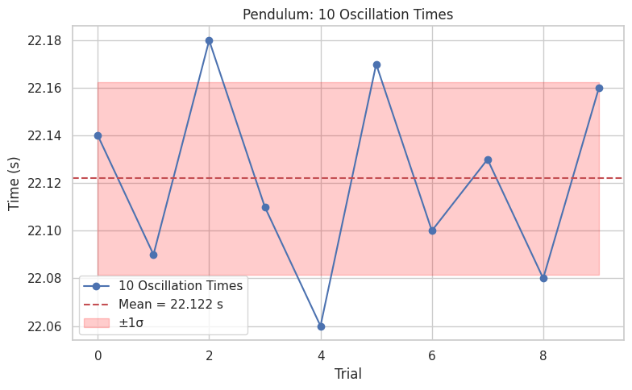

# Problem 1
# 📏 Measuring Earth's Gravitational Acceleration with a Pendulum

## 🔷 Theoretical Background

The gravitational acceleration ($g$) is a fundamental constant in both classical and modern physics. One of the most classical and reliable methods to measure it is using a **simple pendulum**.

For small oscillation angles (θ < 15°), the period of a simple pendulum is given by:

$$
T = 2\pi \sqrt{\frac{L}{g}} \quad \Rightarrow \quad g = \frac{4\pi^2 L}{T^2}
$$

Where:
- $T$ is the period of the pendulum (time for one complete swing),
- $L$ is the length from the pivot point to the center of mass of the bob,
- $g$ is the local acceleration due to gravity.

---

## 🧪 Materials and Setup

### ✅ Required Materials
- A **string** (around 1–1.5 meters long)  
- A **weight** (e.g., salt pack, keychain, or bag of coins)  
- A **stopwatch** or smartphone timer  
- A **ruler** or measuring tape  

---

# Experiment: Determining $g$ with a Pendulum

## 1. Experimental Setup

- **Pendulum Length (L):** 1.2 m  
- **Weight Used:** 500 g salt pack  
- **Measuring Tool Resolution:** 1 mm  
- **Uncertainty in Length (ΔL):** 0.0005 m (half of 1 mm)

## 2. Time Measurements

Each value below represents the time taken for **10 complete oscillations** of the pendulum:

| Trial | Time for 10 Oscillations ($T_{10}$) [s] |
|-------|---------------------------|
| 1     | 22.14                     |
| 2     | 22.09                     |
| 3     | 22.18                     |
| 4     | 22.11                     |
| 5     | 22.06                     |
| 6     | 22.17                     |
| 7     | 22.10                     |
| 8     | 22.13                     |
| 9     | 22.08                     |
| 10    | 22.16                     |

- **Mean Time for 10 Oscillations ($\overline{T}_{10}$):** 22.122 s  
- **Standard Deviation ($\sigma_T$):** 0.041 s  
- **Uncertainty in Mean Time ($\Delta T_{10}$):** 0.013 s ($\sigma_T / \sqrt{10}$)

## 3. Period and Uncertainty

- **Period (T):**  

$$T = \frac{22.122}{10} = 2.212 \ \text{s}$$

- **Uncertainty in T (ΔT):**

$$\Delta T = \frac{0.013}{10} = 0.0013 \ \text{s}$$

## 4. Calculating Gravitational Acceleration

Using the formula:  
$$g = \frac{4\pi^2L}{T^2}$$

Substituting values:  
$$g = \frac{4\pi^2 \cdot 1.2}{(2.212)^2} \approx 9.65\ \text{m/s}^2$$

## 5. Uncertainty in $g$

Propagating uncertainty:

$$
\Delta g = g \cdot \sqrt{\left(\frac{\Delta L}{L}\right)^2 + \left(2\cdot\frac{\Delta T}{T}\right)^2}
$$

With values:
- $\frac{\Delta L}{L} = \frac{0.0005}{1.2} \approx 0.00042$  
- $\frac{\Delta T}{T} = \frac{0.0013}{2.212} \approx 0.00059$  

Then:
$$
\Delta g \approx 9.65 \cdot \sqrt{(0.00042)^2 + (2 \cdot 0.00059)^2} \approx 0.011\ \text{m/s}^2
$$

- **Final Result:**  
$$g = 9.65 \pm 0.01\ \text{m/s}^2$$

## 6. Analysis

- The measured $g$ is slightly lower than the standard 9.81 m/s², possibly due to timing errors or slight violations of the small-angle approximation.
- Measurement precision affects $\Delta L$ — using a finer ruler would reduce this.
- Human reaction time is a key source of error in $\Delta T$, even over 10 swings.
- **Assumptions Made:**  
  - The pendulum swings in a perfect arc.  
  - Air resistance and pivot friction are negligible.  
  - The initial angle was below 15°.

---

